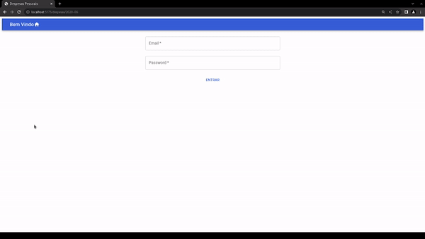

# PersonalFinance
Projeto realizado durante a pós-graduação em Desenvolvimento FullStack IGTI - XP Educação 

Projeto realizado durante a pós-graduação em Desenvolvimento FullStack IGTI - XP Educação 
Trata-se de um trecho de app sobre finanças pessoais no qual as despesas são apresentadas por mês de forma discriminada e resumida (em forma de tabela e gráfico).
O backend foi inteiramente disponibilizado pelo professor, com alguns ajustes desta desenvolvedora.
Este projeto faz uso de: Material UI, react-google-charts e contém exemplos de uso dos reacts hooks useEffect, useState, useNavigate, useParams.
